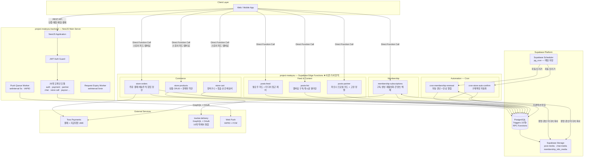

# MateYou — Backend Portfolio

> 팬덤 기반 커머스 · 콘텐츠 구독 · 파트너 매칭 플랫폼의 풀스택 백엔드  
> **TypeScript · NestJS · Deno · Supabase Edge Functions · PostgreSQL · Toss Payments**

---

## Table of Contents

1. [Project Overview](#1-project-overview)
2. [Repository Structure](#2-repository-structure)
3. [System Architecture](#3-system-architecture)
4. [My Key Contributions](#4-my-key-contributions)
5. [Core Logic Highlights](#5-core-logic-highlights)
6. [Tech Stack](#6-tech-stack)
7. [Environment Variables](#7-environment-variables)

---

## 1. Project Overview

MateYou는 **파트너(크리에이터·스트리머)** 와 **팬(유저)** 을 연결하는 팬덤 커머스 플랫폼입니다.

파트너는 게임 매칭·스트리밍 서비스를 제공하고, 멤버십 구독으로 팬과 지속적인 관계를 맺으며, 스토어를 통해 실물·디지털 굿즈를 직접 판매합니다. 유저는 포인트 기반 경제 안에서 콘텐츠를 구매하고, 피드를 통해 구독 파트너의 전용 콘텐츠를 소비합니다.

단순한 매칭 앱이 아닙니다. **반복 결제(멤버십 구독)**, **커머스(스토어)**, **콘텐츠 접근 제어(피드)**, **수익 정산(포인트 경제)** 이 유기적으로 맞물린 팬덤 비즈니스 플랫폼입니다.

```
팬 (유저)
  ├─ [포인트 결제] ──▶ 멤버십 구독   ──▶ 전용 콘텐츠 접근 (Signed URL)
  └─ [포인트 결제] ──▶ 스토어 구매   ──▶ 배송 · 디지털 수령

파트너 (크리에이터)
  ├─ [콘텐츠 등록] ──▶ 피드 게시     ──▶ 구독자에게 tier별 노출
  ├─ [멤버십 설정] ──▶ 자동 갱신     ──▶ 운영 개입 없이 반복 수익 창출 (Cron)
  └─ [상품 등록]   ──▶ 협업 판매     ──▶ 다자간 수익 자동 배분
```

---

## 2. Repository Structure

이 리포지토리는 **두 개의 독립적인 백엔드 프로젝트**로 구성됩니다.

```
mateyou/
├── project-mateyou-backend/        # NestJS 메인 API 서버
│   └── src/
│       ├── auth/                   # JWT 인증·인가
│       ├── payment/                # Toss Payments 결제·지급대행
│       ├── partner/                # 파트너 프로필·매칭
│       ├── chat/                   # 실시간 채팅
│       ├── voice-call/             # WebRTC 음성·영상 통화
│       ├── push/                   # Web Push Queue Worker
│       └── ...                     # 총 25개 도메인 모듈
│
└── project-mateyou/                # Supabase Edge Functions ◀ 이준 주도 개발
    └── functions/
        ├── posts-feed/             # 팔로우 피드 + 미디어 접근 제어
        ├── posts-list/             # 멤버십 구독 게시글 필터링
        ├── posts-partner/          # 파트너 프로필 피드 + 고정 정렬
        ├── store-products/         # 상품 등록·수정·관리
        ├── store-cart/             # 장바구니 + 배송비 계산
        ├── store-orders/           # 주문·결제·정산·배송추적
        ├── membership-subscriptions/  # 구독 생성·재활성화·접근 해제
        ├── cron-membership-renewal/   # 멤버십 자동 갱신 Cron
        └── cron-store-auto-confirm/   # 구매확정 자동화 Cron
```

| 프로젝트 | 담당 범위 | 런타임 |
|---|---|---|
| `project-mateyou-backend` | 인증, 실시간 매칭·채팅, 지급대행, 푸시 큐 | NestJS / Node.js |
| `project-mateyou` | **스토어, 피드, 멤버십, Cron 자동화 (이준 전담)** | Deno / Supabase Edge Functions |

---

## 3. System Architecture



### 두 서버의 책임 분리 원칙

**NestJS 메인 서버**는 동기적 응답과 상태 관리가 필요한 핵심 영역을 담당합니다. JWT 기반 인증·인가, 실시간 WebRTC 시그널링, 채팅 이벤트, Toss 지급대행 JWE 암호화처럼 요청-응답 사이클이 짧고 내부 워커 조율이 필요한 도메인입니다.

**Supabase Edge Functions**는 비즈니스 규칙이 복잡하고 외부 서비스 연동이 많은 도메인을 독립된 서버리스 함수로 분리합니다. 각 함수는 독립적으로 배포·확장되며, Supabase Scheduler(pg_cron)가 Cron을 자동 트리거하므로 **별도의 작업 서버 없이 운영 자동화**가 완성됩니다. 이 구조 덕분에 스토어·피드·멤버십 도메인의 비즈니스 로직은 메인 서버의 변경에 영향받지 않고 독립적으로 진화합니다.

---

## 4. My Key Contributions

`project-mateyou` Supabase Functions 전체를 주도적으로 설계하고 구현했습니다. **단순한 기능 구현이 아니라, 수익 모델(BM)이 기술적으로 어떻게 동작하는지를 코드로 번역**하는 역할이었습니다. 멤버십 구독이 수익을 만들고, Cron이 그 수익을 유지하고, 피드가 구독 가치를 증명하고, 스토어가 추가 수익을 창출하는 전체 사이클을 백엔드에서 책임졌습니다.

---

### 4-1. Commerce & Feed — 수익 생태계의 기술적 구현

스토어와 피드는 플랫폼의 두 가지 수익 채널입니다. 이 두 채널이 포인트 경제 및 멤버십 시스템과 유기적으로 연결되도록 설계했습니다.

**스토어 (`store-products` · `store-cart` · `store-orders`)** 는 파트너가 협업 상품을 공동 등록하고 판매 수익을 자동으로 배분받는 **다자간 정산 구조**를 구현합니다. 구매확정(포인트 적립)은 PostgreSQL RPC 트랜잭션으로 처리하여 Cron 중복 실행이나 Webhook 재전송 상황에서도 포인트 이중 적립이 발생하지 않음을 보장했습니다. 배송비는 묶음배송 그룹핑과 산간 지역(제주·울릉도) 추가 요금까지 처리하는 실무 수준의 계산 엔진을 구현했습니다.

**피드 (`posts-feed` · `posts-list` · `posts-partner`)** 는 멤버십 구독 가치를 실질적으로 구현하는 레이어입니다. 게시글 단위가 아닌 **미디어 파일 단위**로 접근 권한을 계산하며, 구독 tier_rank · 미디어 가격 · 구매 여부를 조합한 권한 매트릭스를 설계했습니다. 권한이 확인된 미디어에만 1시간짜리 Signed URL을 발급하고, 원본 Storage 경로는 응답에서 항상 제거하여 URL 우회 접근을 원천 차단했습니다.

```
[피드 미디어 권한 판정]

Admin / 콘텐츠 소유 파트너  → 전체 접근
비로그인 게스트             → tier_rank = 0 미디어만
로그인 (구독 없음)          → tier_rank = 0 + 직접 구매한 인덱스까지
로그인 (멤버십 구독)        → userTierRank ≥ mediaTierRank + 구독 OR 구매

권한 O → createSignedUrl(media_url, 3600)  →  signed_url 응답
권한 X → signed_url: null
항상   → delete media.media_url            →  원본 경로 노출 차단
```

구독 tier_rank 조회 시 게시글마다 DB를 개별 조회하는 N+1 문제를 방지하기 위해, 요청 진입 시 유저의 전체 구독 목록을 **단 1회** 조회하여 `Map<partnerId, maxTierRank>`로 캐싱합니다. 동일 파트너의 복수 멤버십도 최고 tier_rank가 자동 적용됩니다.

**비즈니스 기여:** 구독하지 않은 유저가 전용 콘텐츠를 볼 수 없도록 차단하는 것이 구독 전환을 유도하는 핵심 장치입니다. 동시에 구독 직후에는 콘텐츠가 즉각적으로 열리는 경험을 제공하여 구독 직후 이탈을 방지합니다. 이 두 가지가 피드 접근 제어 엔진이 플랫폼 수익성에 직접 기여하는 방식입니다.

---

### 4-2. Membership Automation — 운영 리소스 없이 반복 수익 유지

멤버십은 파트너의 가장 안정적인 수익원입니다. 그러나 수동으로 갱신을 관리하면 구독자 수에 비례하여 운영 비용이 증가합니다. `cron-membership-renewal`은 이 문제를 기술로 해결합니다.

```
[매일 자정 Supabase Scheduler 자동 트리거]

Phase 1 — 자동 갱신
  대상: auto_renewal_enabled=true, expired_at=오늘

  포인트 충분
  └─ 포인트 차감 → 만료일 +1개월 → 파트너 수익 적립
     → 갱신 성공 푸시 알림
     → renewal_message + 미디어 파일 → 구독자 채팅방 자동 발송
        (membership_info_media 버킷 → chat-media 버킷 간 복사)

  포인트 부족
  └─ status = 'canceled' → 갱신 실패 알림 → 재충전 유도

Phase 2 — 만료 예정 알림
  대상: auto_renewal_enabled=false, expired_at=내일
  └─ 만료 D-1 알림 → 재구독 유도
```

갱신 완료 시 파트너가 사전 등록한 환영 메시지와 미디어가 구독자 채팅방으로 자동 발송됩니다. 파트너가 구독자 수에 상관없이 수동 대응 없이 일관된 온보딩 경험을 제공할 수 있습니다. 이는 **구독 유지율(retention)을 높이는 자동화된 CRM** 역할을 합니다.

알림 중복 발송 방지는 별도 이력 테이블 없이 `membership_subscriptions` 레코드에 `expiry_notification_dismissed_at` · `renewal_failed_notification_dismissed_at` · `renewed_notification_dismissed_at` 세 컬럼을 내재화하여 해결했습니다. 유저가 알림을 확인하면 PATCH로 기록되고, 다음 Cron 쿼리는 해당 컬럼이 `null`인 레코드만 처리합니다. 스키마 복잡도를 늘리지 않고 기존 엔티티에 상태를 흡수시킨 설계입니다.

**운영 효율화 기여:** 구독 갱신, 결제 실패 처리, 만료 알림, 갱신 환영 메시지까지 모든 반복 작업이 코드로 자동화됩니다. 구독자가 100명이든 100,000명이든 운영 리소스가 추가로 필요하지 않습니다.

---

### 4-3. Governance — 플랫폼 신뢰의 기술적 토대

신고·차단 시스템은 직접적인 수익 지표에는 나타나지 않지만, 플랫폼이 장기적으로 신뢰를 유지하기 위한 필수 인프라입니다.

`posts-feed.ts`에 구현된 **양방향 차단 필터링**은 "내가 차단한 파트너"의 게시글을 숨기는 것을 넘어, "나를 차단한 사용자"의 콘텐츠도 내 피드에서 제거합니다. 차단 관계는 `member_code`와 `member_id` 두 가지 식별자가 혼재하는 레거시 구조를 가지고 있어, 양방향 조회 결과를 Set으로 중복 제거하는 방어적 설계를 적용했습니다.

신고 기능은 플랫폼의 자정 능력을 만드는 장치입니다. 신고 누적 시 콘텐츠 가시성 제한 → 관리자 검토 큐 진입 → 반복 위반 시 계정 조치로 이어지는 파이프라인의 시작점입니다. 파트너 생태계의 신뢰도가 유지되어야 유저 이탈이 줄고, 이는 결국 구독·구매 전환율로 이어집니다.

---

## 5. Core Logic Highlights

### 5-1. 멤버십 구독 — 10단계 보상 트랜잭션 파이프라인

멤버십 구독 API는 단순한 레코드 삽입이 아닙니다. 포인트 결제부터 콘텐츠 접근 즉시 해제, 환영 미디어 전송까지 10개 작업이 연쇄적으로 실행됩니다. Supabase 클라이언트가 네이티브 멀티 스텝 트랜잭션을 지원하지 않는 환경에서 **보상 트랜잭션(Compensating Transaction) 패턴**으로 원자성을 보장했습니다.

```
POST /api-membership-subscriptions

Step  1.  멤버십 유효성 검증 (is_active, price > 0)
Step  2.  유저 포인트 잔액 확인 (currentPoints ≥ totalPrice)
Step  3.  구독 레코드 생성 또는 재활성화 (inactive → active)
Step  4.  member_points_logs INSERT ─────────────────────────┐
Step  5.  members.total_points 차감                          │  실패 시
              ↑ 오류 → Step 4 로그 + Step 3 레코드 명시적 삭제 ◀──┘  보상 롤백
Step  6.  partners.total_points 적립 + partner_points_logs
Step  7.  album_posts 썸네일에 Signed URL 즉시 발급
              → API 응답 수신 즉시 콘텐츠 노출 (별도 재호출 불필요)
Step  8.  membership.subscription_count 증가
Step  9.  파트너에게 신규 구독 푸시 알림
Step 10.  구독자에게 환영 메시지 + 멀티미디어 채팅 자동 발송
```

**Step 7이 핵심입니다.** 구독 전 멤버십 전용 게시글은 `album_posts.thumbnail = null`로 저장되어 블러 처리됩니다. 구독 완료 핸들러 내에서 Signed URL을 **동기적으로** 발급하여 DB에 기록하면, 구독 API 응답이 클라이언트에 도달하는 순간 콘텐츠가 이미 열려 있습니다. 구독 직후 "아직 보이지 않는" 상태로 인한 이탈을 기술적으로 차단한 UX 설계입니다. 단, 썸네일 갱신 실패가 핵심 결제 흐름을 오염시키지 않도록 별도 `try-catch`로 격리했습니다.

---

### 5-2. 구매확정 자동화 — PostgreSQL RPC로 트랜잭션 문제 해결

배송 완료 후 3일 경과 주문의 자동 구매확정은 **멱등성**과 **원자성**이 동시에 요구되는 시나리오입니다.

**초기 설계의 문제:** Edge Function에서 순차 처리하면 `store_orders` 상태 변경 → `partners.store_points` 적립 → `partner_points_logs` 기록 사이 실패 시 불완전한 상태가 DB에 남습니다. Cron이 재실행되면 이미 상태가 변경된 주문을 재처리하여 포인트 이중 적립이 발생합니다.

**해결:** 구매확정 비즈니스 로직 전체를 PostgreSQL RPC 함수로 이전하고, Edge Function은 RPC를 트리거하는 얇은 진입점으로만 남겼습니다.

```typescript
// Edge Function — 실행 진입점만 담당
const { data: rpcResult } = await supabase.rpc(
  'rpc_store_auto_confirm',
  { p_days_threshold: daysThreshold }  // 기본값: 3일
);

// PostgreSQL RPC 내부 — 트랜잭션 보장
// BEGIN
//   UPDATE store_orders     SET is_confirmed = true  WHERE delivered + 3d ago
//   UPDATE store_order_items SET status = 'confirmed' WHERE ...
//   UPDATE partners          SET store_points += net_amount WHERE ...
//   INSERT INTO partner_points_logs ...
// COMMIT  ← 전체 성공 또는 전체 롤백
```

관리자용 수동 확정(`PUT /cron-store-auto-confirm`)도 동일한 `rpc_store_confirm_order`를 사용합니다. **자동/수동 경로가 하나의 RPC를 공유**하므로 로직 수정 시 두 경로가 자동으로 동기화됩니다.

---

### 5-3. 협업 상품 다자간 정산 — 2단계 배율 구조와 멱등성

일반 상품과 달리 협업 상품은 여러 파트너가 동일 원본 상품을 공동 판매하여 수익을 나눕니다. `share_rate`(전체 수익 중 각자 몫)와 `distribution_rate`(개인 몫 중 실제 지급율)의 2단계 구조를 설계했습니다.

```typescript
// [배분율 모드] share_rate가 설정된 경우
// 예: 총 판매액 100,000원, share_rate=60%, dist_rate=80%
//     → 파트너 적립 = 100,000 × 0.60 × 0.80 = 48,000원
const partnerAmount = Math.floor(
  totalAmount * (shareRate / 100) * (distRate / 100)
);

// [개별 정산 모드] share_rate가 전원 null인 경우
// 주문 파트너에게만 dist_rate 적용
const settledAmount = Math.floor(totalAmount * (distRate / 100));
```

중복 적립 방지를 위해 `log_id = store_sale_{orderId}_{partnerId}_{productId}` 결정론적 고유 키를 사용합니다. 정산 전 `partner_points_logs`에서 동일 `log_id` 존재 여부를 확인하고 이미 존재하면 건너뜁니다. Webhook 재전송이나 Cron 중복 실행 상황에서도 정산은 정확히 1회만 처리됩니다.

---

### 5-4. 배송추적 — 2단계 캐싱으로 외부 API 의존도 최소화

10개 택배사 배송 상태를 tracker.delivery GraphQL API로 통합 조회하면서, 매 요청마다 외부 API를 호출하면 레이턴시와 비용이 과중하게 발생합니다.

**1단계 — OAuth 토큰 인메모리 캐시:** `expiresAt = Date.now() + (expires_in - 60) * 1000`으로 저장하여 만료 1분 전부터 갱신합니다. 함수 인스턴스 생존 기간 동안 불필요한 토큰 재발급 요청을 제거합니다.

**2단계 — 배송 이벤트 DB 캐시:** `store_shipments.delivery_updated_at`이 5분 이내면 DB에 저장된 이벤트 히스토리를 반환합니다. 5분 초과 시에만 GraphQL을 호출하고 결과를 DB에 저장합니다. 추가로 `registerTrackWebhook` Mutation으로 배달 완료 이벤트를 Webhook으로 수신하여, 상태 변경 시 폴링 없이 실시간 업데이트가 가능합니다.

---

### 5-5. 장바구니 배송비 계산 — 묶음배송 × 산간 지역 조합

실무 커머스에서 배송비는 단순한 고정값이 아닙니다. 묶음배송 여부(파트너 직접 / 협업)와 배송지 지역(일반 / 산간)을 조합하면 4가지 경우가 발생하며, 각각을 정확히 처리합니다.

```typescript
// 산간 지역 판별 — 우편번호 기반
function isRemoteArea(postalCode: string): boolean {
  const code = parseInt(postalCode.replace(/\D/g, ''), 10);
  if (code >= 63000 && code <= 63644) return true; // 제주도
  if (code >= 40200 && code <= 40240) return true; // 울릉도
  return false;
}

// 배송비 계산 매트릭스
//
//               | 묶음 상품              | 비묶음 상품
// 파트너 직접   | max(base + remote)     | Σ (base + remote)
// 협업 상품     | max(base + remote)     | Σ (base + remote)
//
// 묶음 적용 시에도 (base + remote) 합산 기준으로 max를 취하여
// 산간 추가 배송비가 누락되지 않도록 처리
const getItemShippingFee = (item: CartItem) =>
  (item.product.shipping_fee_base || 0) +
  (isRemote ? item.product.shipping_fee_remote || 0 : 0);
```

---

## 6. Tech Stack

| 분류 | 기술 | 선택 이유 |
|---|---|---|
| **Main Server** | NestJS (TypeScript) | 모듈 기반 DI, 대규모 도메인 분리, Swagger 통합 |
| **Serverless Functions** | Deno + Supabase Edge Functions | 표준 Web API 사용, 런타임 종속성 최소화 |
| **Database** | PostgreSQL (Supabase) | RPC 트랜잭션, Trigger 기반 포인트 집계, pg_cron |
| **Auth** | Supabase Auth + NestJS JWT Guard | Row Level Security 연동, 역할 기반 접근 제어 |
| **Payment** | Toss Payments | 결제 + 지급대행 + JWE/AES-256-GCM 암호화 |
| **Storage** | Supabase Storage | Signed URL 기반 동적 미디어 접근 제어 |
| **Push** | Web Push Protocol (VAPID) + FCM | 서드파티 서비스 없는 자체 푸시 인프라 |
| **Delivery** | tracker.delivery GraphQL API | 10개 택배사 통합, OAuth + Webhook 지원 |
| **Scheduling** | Supabase Scheduler (pg_cron) | 별도 작업 서버 없는 Cron 자동화 |
| **Real-time** | Supabase Realtime + WebRTC | 채팅 실시간 이벤트, 음성·영상 통화 시그널링 |
| **API Docs** | Swagger (swagger-jsdoc) | 데코레이터 기반 자동 문서화 |

---

## 7. Environment Variables

### `project-mateyou-backend` (NestJS)

```bash
# Server
PORT=4000
NODE_ENV=production

# Supabase
SUPABASE_URL=https://xxxx.supabase.co
SUPABASE_ANON_KEY=eyJ...
SUPABASE_SERVICE_ROLE_KEY=eyJ...

# Toss Payments — 일반 결제
TOSS_PAY_PROD_SECRET_KEY=live_sk_...

# Toss Payments — 지급대행 (JWE 암호화)
TOSS_API_PROD_SECRET_KEY=live_gsk_...
TOSS_API_PROD_SECURITY_KEY=<64자 hex>
TOSS_USE_PYTHON_ENCRYPTION=false        # Node.js jose(기본) vs Python authlib

# Web Push (VAPID)
VAPID_PUBLIC_KEY=...
VAPID_PRIVATE_KEY=...
VAPID_SUBJECT=mailto:noreply@mateyou.com

# Worker 튜닝
PUSH_QUEUE_INTERVAL=5000                # Push Queue 폴링 간격 (ms)
PUSH_QUEUE_BATCH_SIZE=50                # 1회 처리 최대 건수
ENABLE_PUSH_QUEUE_WORKER=true
REQUEST_EXPIRY_INTERVAL=300000          # 의뢰 만료 체크 간격 (ms)
ENABLE_REQUEST_EXPIRY_WORKER=true
```

### `project-mateyou` (Supabase Edge Functions)

```bash
# Supabase (Edge Functions 실행 환경에서 자동 주입)
SUPABASE_URL=https://xxxx.supabase.co
SUPABASE_ANON_KEY=eyJ...
SUPABASE_SERVICE_ROLE_KEY=eyJ...

# 배송추적 (tracker.delivery OAuth 2.0)
TRACKER_DELIVERY_CLIENT_ID=...
TRACKER_DELIVERY_CLIENT_SECRET=...
```

> **보안 주의:** Toss Payments `test_` / `live_` 키 구분은 서버 시작 시 자동으로 검증됩니다. 프로덕션에서 `test_` 키가 감지되면 명시적 오류 로그와 함께 요청이 거부됩니다.

---

<div align="center">

**이준 (Lee Jun)** · Backend Engineer

`TypeScript` `NestJS` `Deno` `Supabase` `PostgreSQL` `Toss Payments`

*수익 모델이 코드로 작동하도록 설계합니다.*

</div>
