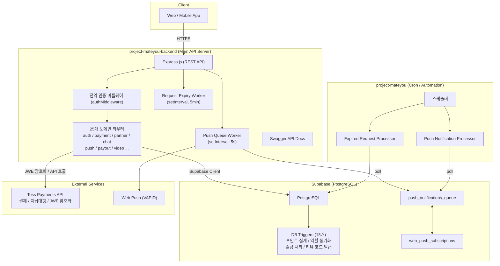

# MateYou Backend — 포트폴리오

> **게이밍 파트너 매칭 플랫폼**의 백엔드 서버 및 자동화 서비스 통합 저장소  
> TypeScript / Node.js / Supabase(PostgreSQL) / Toss Payments

---

## 목차

1. [프로젝트 개요](#1-프로젝트-개요)
2. [서비스 아키텍처](#2-서비스-아키텍처)
3. [기술 스택 및 선정 이유](#3-기술-스택-및-선정-이유)
4. [핵심 기능 상세](#4-핵심-기능-상세)
5. [데이터베이스 설계](#5-데이터베이스-설계)
6. [트러블슈팅 및 성능 최적화](#6-트러블슈팅-및-성능-최적화)
7. [환경 설정](#7-환경-설정)

---

## 1. 프로젝트 개요

MateYou는 게임을 함께할 파트너를 찾는 사용자(Member)와 서비스를 제공하는 파트너(Partner)를 연결하는 플랫폼입니다. 단순한 매칭을 넘어 **코인 기반 포인트 경제**, **실시간 음성/화상 통화**, **정산 자동화**까지 아우르는 비즈니스 로직을 처리합니다.

이 저장소는 두 개의 독립적인 서버 프로세스로 구성됩니다.

| 프로젝트 | 역할 |
|---|---|
| `project-mateyou-backend` | 클라이언트 요청을 처리하는 메인 REST API 서버 |
| `project-mateyou` | 알림 큐, 의뢰 만료 등 주기적 작업을 처리하는 자동화 서비스 |

---

## 2. 서비스 아키텍처

### 전체 구성도



### 두 서비스의 분리 전략

메인 서버(`project-mateyou-backend`)는 API 응답 속도를 최우선으로 두기 때문에, 알림 전송이나 만료 처리처럼 **실패해도 API 응답에 영향을 주지 않아야 하는 작업**을 백그라운드 워커로 분리했습니다. 이 워커들은 서버 프로세스 내에 `setInterval`로 내장되어 있으며, `project-mateyou`는 그것을 별도 프로세스로 실행하는 자동화 레이어입니다. 두 서버 모두 동일한 Supabase 데이터베이스를 공유하며, 상태는 DB의 `push_notifications_queue` 테이블을 통해 전달됩니다.

---

## 3. 기술 스택 및 선정 이유

### Runtime & Language

**TypeScript / Node.js**를 선택한 핵심 이유는 타입 안전성입니다. 결제, 정산, 포인트 처리처럼 숫자 연산이 많은 비즈니스 로직에서 `any` 타입 남용 없이 인터페이스를 명시하면 런타임 에러를 컴파일 단계에서 사전에 차단할 수 있습니다. `push-queue.ts`의 `PushNotificationQueueItem`, `PushSubscription` 인터페이스가 이를 잘 보여줍니다.

### Database — Supabase (PostgreSQL)

별도의 ORM을 두지 않고 **Supabase Client를 직접 사용**한 것은 의도적인 선택입니다. PostgreSQL의 트리거와 함수를 적극적으로 활용하여 포인트 집계, 역할 동기화 등 **데이터 정합성이 핵심인 로직을 DB 레이어에 위임**했습니다. 애플리케이션 코드가 아닌 DB가 이를 보장하기 때문에, 어떤 클라이언트 경로로 데이터가 변경되더라도 일관성이 깨지지 않습니다.

### 결제 — Toss Payments

국내 PG 중 지급대행(Payout) API를 공식으로 지원하며, JWE(JSON Web Encryption) 방식의 보안 규격을 명확히 문서화하고 있어 선택했습니다. 파트너에 대한 정산이라는 민감한 도메인을 다루는 만큼, 검증된 금융 파트너와의 연동이 필수였습니다.

### 알림 — Web Push (VAPID)

별도의 유료 알림 서비스 없이 W3C 표준인 **Web Push Protocol**을 직접 구현했습니다. `web-push` 라이브러리와 VAPID 키 기반 인증을 통해 서버가 직접 브라우저의 Push Service에 메시지를 전달합니다. 구독 정보(`p256dh`, `auth`, `endpoint`)를 `web_push_subscriptions` 테이블에서 관리하며, 만료된 구독(HTTP 410/404)은 자동으로 DB에서 삭제됩니다.

---

## 4. 핵심 기능 상세

### 4-1. 메인 API 서버 — 도메인 구조

`index.ts`의 라우터 선언을 보면 서비스가 다루는 도메인의 넓이를 확인할 수 있습니다. 25개의 라우터가 각각 독립된 파일로 분리되어 있으며, 전역 `authMiddleware`가 공개 엔드포인트를 자동으로 판별해 모든 라우터에 일괄 적용됩니다.

```
/api/auth          — 소셜 로그인 / 인증
/api/members       — 회원 관리
/api/partners      — 파트너 관리 (승인 플로우 포함)
/api/partner-settlement — 파트너 정산
/api/payment       — 결제 처리 (Toss Payments)
/api/payouts       — 지급대행 (Toss Payout API)
/api/toss          — Toss 웹훅 수신 및 처리
/api/chat          — 실시간 채팅
/api/voice-call    — 음성 통화 (room 관리)
/api/video         — 화상 통화
/api/push          — 푸시 알림
/api/rankings      — 파트너 랭킹
/api/reviews       — 리뷰 및 평점
...
```

### 4-2. Toss Payments 연동 — 결제 + 지급대행 이원화

결제와 정산은 Toss Payments에서 **서로 다른 Secret Key 체계**(`live_sk` vs `live_gsk`)를 사용합니다. `toss-auth.ts`는 이를 명확히 분리하여 `getTossPaymentSecretKey()`와 `getTossPayoutSecretKey()` 두 함수로 제공하며, 하위 호환을 위한 `getTossSecretKey()`는 `@deprecated`로 명시했습니다.

환경 변수 탐색 우선순위도 명확히 설계되어 있습니다.

```
# 지급대행 키 탐색 순서
TOSS_API_PROD_SECRET_KEY   ← 1순위 (live_gsk 전용)
TOSS_PAY_PROD_SECRET_KEY   ← 2순위
TOSS_PAY_SECRET_KEY_REAL   ← 3순위
TOSS_PROD_SECRET_KEY       ← 4순위
...fallback keys
```

test_ 키가 환경 변수에 설정되어 있으면 조용히 건너뛰는 것이 아니라 **`console.error`로 명시적으로 경고**하여 실수로 테스트 키가 프로덕션에 적용되는 상황을 방지합니다.

### 4-3. JWE 암호화 — Node.js와 Python 이중화

Toss Payments 지급대행 API는 요청 페이로드를 **A256GCM 방식의 JWE**로 암호화해야 합니다. `toss.ts`는 이를 두 가지 구현체로 제공합니다.

- **Node.js 구현** (`jose` 라이브러리): 기본 경로. 16진수 보안 키를 `Buffer.from(key, 'hex')`로 바이트 변환 후 AES-256-GCM으로 암호화합니다. JWE 헤더에는 KST 타임존 기반의 `iat`와 랜덤 UUID `nonce`를 포함해 재전송 공격(Replay Attack)을 방어합니다.

- **Python 구현** (`authlib.jose`, `child_process.spawn`): `TOSS_USE_PYTHON_ENCRYPTION=true` 환경 변수로 활성화. Toss 공식 문서의 Python 예제와 동일한 라이브러리를 사용해야 할 때 전환할 수 있습니다. 두 구현체를 런타임에 플래그 하나로 교체할 수 있는 구조는 외부 API 명세 변경에 대한 대응 유연성을 확보한 것입니다.

```typescript
// 환경에 따른 암호화 구현체 선택
const shouldUsePython = usePython ?? process.env.TOSS_USE_PYTHON_ENCRYPTION === "true";
if (shouldUsePython) {
  return await encryptPayloadWithPython(payload, securityKey);
}
// 기본: Node.js jose 구현
```

### 4-4. Push Notification Queue — DB 기반 비동기 알림

알림 전송을 단순히 API 호출 시점에 동기로 처리하면, 외부 Push Service의 지연이 API 응답 시간에 직접 영향을 줍니다. 이를 해결하기 위해 **DB 큐 패턴**을 도입했습니다.

**흐름:**
1. 알림이 필요한 시점에 `addToPushQueue()`로 `push_notifications_queue` 테이블에 레코드 삽입 (`status: 'pending'`)
2. 백그라운드 워커(`processPushQueue`)가 5초 간격으로 `pending` 상태인 레코드를 배치(기본 50건)로 가져와 처리
3. 처리 중에는 `processing`으로 상태 변경 (중복 처리 방지)
4. 전송 성공 시 `sent`, 실패 시 `retry_count`를 확인하여 `max_retries` 미만이면 `pending`으로 재대기, 초과 시 `failed`로 마감

만료된 Push 구독(HTTP 410/404 응답)은 즉시 DB에서 삭제하여 불필요한 재시도를 원천 차단합니다.

**환경 변수를 통한 워커 튜닝:**

```bash
PUSH_QUEUE_INTERVAL=5000     # 폴링 간격 (ms)
PUSH_QUEUE_BATCH_SIZE=50     # 배치 처리 수
ENABLE_PUSH_QUEUE_WORKER=true  # 워커 활성화 여부
REQUEST_EXPIRY_INTERVAL=300000 # 의뢰 만료 체크 간격 (5분)
```

워커 시작 시 비정상적으로 짧은 간격이나 큰 배치 사이즈가 설정되면 경고 로그를 출력하는 방어 로직도 포함되어 있습니다.

### 4-5. Graceful Shutdown

`SIGTERM` 시그널 수신 시 진행 중인 워커의 `setInterval`을 명시적으로 `clearInterval`하여, 프로세스 종료 시 큐 처리 중단으로 인한 데이터 불일치를 방지합니다.

```typescript
process.on("SIGTERM", () => {
  if (pushQueueWorkerInterval) clearInterval(pushQueueWorkerInterval);
  if (requestExpiryWorkerInterval) clearInterval(requestExpiryWorkerInterval);
  process.exit(0);
});
```

---

## 5. 데이터베이스 설계

### 핵심 도메인 모델

```
members ──────────────── partners (1:1)
   │                         │
   │                     partner_jobs (1:N)
   │                         │
   └── partner_requests ──────┘ (N:M 역할)
            │
           jobs (1:N)
            │
          reviews (1:1)
```

**`partner_requests.total_coins`** 는 `job_count * COALESCE(coins_per_job, 0)`로 정의된 **Generated Column**입니다. 애플리케이션 레이어에서 계산하지 않고 DB가 항상 정확한 값을 유지합니다.

### DB Trigger 기반 비즈니스 로직

비즈니스 로직의 일부를 PostgreSQL 트리거로 구현한 것은 **데이터 일관성 보장의 책임을 DB에 집중**시키기 위한 설계 결정입니다. 어떤 경로(API, Supabase 대시보드, 직접 쿼리)로 데이터가 변경되더라도 아래 로직은 반드시 실행됩니다.

| 트리거 | 실행 시점 | 동작 |
|---|---|---|
| `trg_member_points_refresh` | `member_points_logs` INSERT/UPDATE/DELETE | `members.total_points`를 전체 로그 합산으로 재계산 |
| `trg_handle_partner_withdrawal` | `partner_withdrawals.status` → `approved` | `partners.total_points`에서 출금액 차감 |
| `trg_log_partner_total_points_change` | `partners.total_points` 변경 | `partner_points_logs`에 자동 감사 로그 기록 |
| `trg_pr_default_coins` | `partner_requests` INSERT | `partner_job_id`로 단가 자동 조회 및 세팅 |
| `trg_set_member_role_partner` | `partners` INSERT | `members.role`을 `partner`로 자동 승격 |
| `trg_sync_partner_name` | `members.name` 변경 | `partners.partner_name` 자동 동기화 |
| `trg_set_job_review_code` | `jobs` INSERT | `review_code` UUID 자동 발급 |

특히 `refresh_member_total_points`는 포인트 로그 전체를 재집계하는 방식으로 동작합니다. 로그의 INSERT/DELETE/UPDATE 어느 케이스에서도 포인트 합계가 오염되지 않도록, 누적 연산이 아닌 **전체 재계산(idempotent)** 방식을 선택한 것입니다.

### 인덱스 전략

조회 빈도가 높은 외래키 컬럼과 상태 필터링 컬럼에 인덱스를 명시적으로 설계했습니다.

```sql
-- 의뢰 조회: partner_id, client_id, status 모두 인덱스 보유
idx_partner_requests_partner (partner_id)
idx_partner_requests_client  (client_id)
idx_partner_requests_status  (status)

-- 통화 참여자: 3방향 모두 인덱스
idx_call_participants_room_id
idx_call_participants_member_id
idx_call_participants_partner_id

-- Toss 셀러 ID: Partial Index (NULL 제외)
partners_tosspayments_ref_idx ON tosspayments_ref_seller_id WHERE NOT NULL
```

Toss 셀러 ID에 `WHERE NOT NULL` 조건을 붙인 **Partial Index**는 미등록 파트너가 다수인 상황에서 인덱스 크기를 최소화하면서도 정산 대상 조회 성능을 확보하기 위한 선택입니다.

---

## 6. 트러블슈팅 및 성능 최적화

### [이슈 1] Toss Payments JWE 암호화 호환성

**문제:** Node.js의 `jose` 라이브러리로 생성한 JWE가 Toss Payments 서버에서 복호화 실패하는 케이스가 발생했습니다. Toss 공식 예제가 Python `authlib.jose`를 기준으로 작성되어 있어, 두 구현 간의 미묘한 헤더 포맷 차이가 원인이었습니다.

**해결:** Node.js 구현을 유지하면서 Python 구현체를 **`child_process.spawn`으로 런타임에 호출**하는 방식을 병행 구현했습니다. 환경 변수(`TOSS_USE_PYTHON_ENCRYPTION`) 하나로 두 구현체를 무중단으로 전환할 수 있어, 재현이 어려운 암호화 호환성 이슈를 프로덕션에서 빠르게 검증하고 격리할 수 있었습니다.

### [이슈 2] 푸시 알림 전송 실패로 인한 API 레이턴시 증가

**문제:** 알림 전송을 API 핸들러 내에서 동기로 처리하던 초기 구조에서, 외부 Push Service 응답 지연이 API 응답 시간에 직접 영향을 주는 문제가 있었습니다.

**해결:** DB 큐 기반의 비동기 처리 아키텍처로 전환했습니다. API는 `push_notifications_queue` 테이블에 레코드를 삽입하고 즉시 응답을 반환합니다. 실제 전송은 별도 워커가 담당하므로 API 레이턴시와 알림 전송이 완전히 디커플링됩니다.

### [이슈 3] 포인트 동시성 문제

**문제:** 포인트 적립/차감을 애플리케이션 레이어에서 처리할 경우, 동시 요청 시 Race Condition으로 포인트 합계가 어긋날 수 있습니다.

**해결:** 포인트를 직접 UPDATE하는 방식 대신, `member_points_logs` 테이블에 거래 내역을 Append-only로 기록하고, PostgreSQL 트리거(`trg_member_points_refresh`)가 전체 로그를 재집계하여 `members.total_points`를 갱신합니다. DB 트랜잭션 내에서 처리되므로 애플리케이션 레벨의 동시성 제어 없이도 정합성이 보장됩니다.

---

## 7. 환경 설정

### 주요 환경 변수

```bash
# Server
PORT=4000
NODE_ENV=production

# Supabase
SUPABASE_URL=https://xxxx.supabase.co
SUPABASE_SERVICE_ROLE_KEY=...

# Toss Payments — 결제
TOSS_PAY_PROD_SECRET_KEY=live_sk_...

# Toss Payments — 지급대행
TOSS_API_PROD_SECRET_KEY=live_gsk_...
TOSS_API_PROD_SECURITY_KEY=<64자 hex 문자열>

# 암호화 구현체 선택 (default: false = Node.js jose)
TOSS_USE_PYTHON_ENCRYPTION=false

# Web Push (VAPID)
VAPID_PUBLIC_KEY=...
VAPID_PRIVATE_KEY=...
VAPID_SUBJECT=mailto:noreply@mateyou.com

# Worker 튜닝
PUSH_QUEUE_INTERVAL=5000
PUSH_QUEUE_BATCH_SIZE=50
ENABLE_PUSH_QUEUE_WORKER=true
REQUEST_EXPIRY_INTERVAL=300000
ENABLE_REQUEST_EXPIRY_WORKER=true
```

> **보안 주의:** `live_` 접두사가 없는 test_ 키는 서버 시작 시 자동으로 거부되며, 콘솔에 명시적인 에러 로그가 출력됩니다. 환경 변수에 test 키가 혼재하더라도 프로덕션 키만 선택적으로 사용됩니다.

---

## Tech Stack Summary

| 분류 | 기술 |
|---|---|
| Runtime | Node.js (ESM) |
| Language | TypeScript |
| Framework | Express.js |
| Database | PostgreSQL (via Supabase) |
| Auth | Supabase Auth + 자체 JWT 미들웨어 |
| Payment | Toss Payments (결제 + 지급대행) |
| Encryption | JWE / AES-256-GCM (`jose`, `authlib`) |
| Push | Web Push Protocol (VAPID) |
| API Docs | Swagger (swagger-jsdoc) |
| Real-time | Supabase Realtime + WebRTC (voice/video) |
