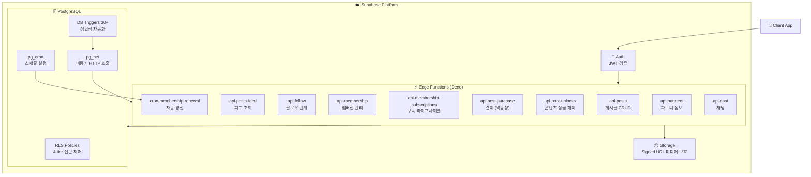
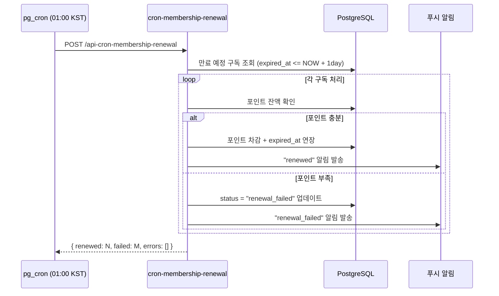

# 🎯 MateU — 크리에이터 콘텐츠 플랫폼 백엔드

> 파트너 크리에이터가 미디어 콘텐츠를 게시·판매하고, 팬이 포인트로 구매·구독하는 콘텐츠 플랫폼의 서버리스 백엔드

[](https://deno.land/)
[](https://supabase.com/)
[](https://www.typescriptlang.org/)
[](https://www.postgresql.org/)

---

## 📌 프로젝트 개요

MateU는 크리에이터(파트너)와 팬(멤버)을 연결하는 콘텐츠 플랫폼입니다.  
본 저장소는 **Supabase Edge Functions** 기반의 서버리스 백엔드로, 다음 4개 도메인을 포함합니다.

| 도메인 | 기간 | 주요 기능 |
|--------|------|-----------|
| **소셜 피드 & 관계 시스템** | 2025.11 | 게시글, 팔로우, 댓글, 미디어 관리 |
| **멤버십 & 유료 콘텐츠** | 2025.12 | 구독, 결제, 자동 갱신, 콘텐츠 잠금 |
| **E-Commerce & 결제 정산** | - | 포인트 충전, 정산 처리 |
| **파트너 & 인증 API** | - | 파트너 신청, JWT 인증, 프로필 관리 |

### 핵심 성과

| 지표 | 수치 |
|------|------|
| 중복 결제 발생 | **0건** (멱등성 보장) |
| 반복 구현 시간 단축 | **~40%** (AI 보조 개발) |
| 구현 Edge Functions | **26개+** |
| DB 트리거 | **30개+** (데이터 정합성 자동화) |
| 콘텐츠 접근 제어 | **4-tier** 멀티레벨 RLS |

---

## 🛠 기술 스택

| 영역 | 기술 | 역할 |
|------|------|------|
| **Runtime** | Deno (TypeScript) | 타입 안전성 + 서버리스 네이티브 |
| **Edge Functions** | Supabase Edge Functions | 26개+ API 엔드포인트 |
| **Database** | PostgreSQL + RLS | 행 수준 보안, 다층 접근 제어 |
| **Cron** | pg_cron | 멤버십 자동 갱신 (매일 KST 01:00) |
| **Trigger** | PostgreSQL Trigger + pg_net | 포인트 감사 로그, 비동기 푸시 알림 |
| **Auth** | Supabase Auth (JWT) | 사용자 인증 + 파트너 권한 분기 |
| **Storage** | Supabase Storage | 미디어 파일, Signed URL 보호 |
| **AI Dev** | Cursor | 반복 코드 자동화, 타입 추론 보조 |

---

## 🏗 아키텍처



---

## 🔑 핵심 로직 상세 설명

### 1. 멱등성 결제 처리 (`api-post-purchase`)

중복 결제를 완전히 차단하는 멱등성 보장 로직입니다.  
**결제 0건 중복 차감**을 달성한 핵심 구현입니다.

```typescript
// post-purchase.ts — 단건 구매 처리 (포인트 차감)
async function handlePostPurchase(supabase, userId, postId) {
  // 1단계: 사전 중복 구매 체크 (멱등성 보장)
  const { data: existing } = await supabase
    .from("post_purchases")
    .select("id")
    .eq("member_id", userId)
    .eq("post_id", postId)
    .maybeSingle();

  if (existing) {
    // 이미 구매한 경우 포인트 차감 없이 즉시 반환
    return successResponse({ alreadyPurchased: true, purchase: existing });
  }

  // 2단계: 포인트 잔액 검증
  const { data: member } = await supabase
    .from("members")
    .select("total_points")
    .eq("id", userId)
    .single();

  if (member.total_points < post.price) {
    return errorResponse("INSUFFICIENT_POINTS", "포인트가 부족합니다.", null, 400);
  }

  // 3단계: 원자적 포인트 차감 + 구매 레코드 생성
  // DB 트리거가 audit log를 자동 생성하여 이중 감소 방지
  const { data: purchase } = await supabase
    .from("post_purchases")
    .insert({ member_id: userId, post_id: postId, points_spent: post.price })
    .select()
    .single();

  return successResponse({ purchase });
}
```

**구현 포인트:**
- `maybeSingle()` 사용으로 null-safe 중복 체크
- DB 레벨 UNIQUE 제약으로 2차 방어선 구축
- 포인트 차감 전 잔액 검증으로 마이너스 방지
- 구매 이력 DB 트리거로 감사 로그 자동 생성

---

### 2. DB 트리거를 통한 데이터 정합성 자동화

30개+ PostgreSQL 트리거로 비즈니스 로직의 일관성을 보장합니다.

```sql
-- 포인트 차감 감사 로그 트리거
CREATE OR REPLACE FUNCTION log_point_transaction()
RETURNS TRIGGER AS $$
BEGIN
  -- 포인트 변경 시 감사 로그 자동 기록
  INSERT INTO point_audit_logs (
    member_id, 
    action_type,
    points_before, 
    points_after,
    delta,
    created_at
  )
  VALUES (
    NEW.id,
    TG_OP,
    OLD.total_points,
    NEW.total_points,
    NEW.total_points - OLD.total_points,
    NOW()
  );
  RETURN NEW;
END;
$$ LANGUAGE plpgsql;

-- pg_net을 활용한 비동기 푸시 알림 트리거
CREATE OR REPLACE FUNCTION notify_push_to_target()
RETURNS TRIGGER AS $$
BEGIN
  -- 메인 트랜잭션에 영향 없이 비동기 HTTP 푸시 발송
  PERFORM net.http_post(
    url := current_setting('app.push_endpoint'),
    body := json_build_object(
      'user_id', NEW.member_id,
      'type', TG_ARGV[0],
      'data', row_to_json(NEW)
    )::text
  );
  RETURN NEW;
EXCEPTION WHEN OTHERS THEN
  -- 알림 실패가 메인 트랜잭션에 영향 없도록 격리
  RAISE WARNING '푸시 알림 전송 실패: %', SQLERRM;
  RETURN NEW;
END;
$$ LANGUAGE plpgsql;
```

**설계 원칙:**
- `EXCEPTION` 블록으로 알림 실패가 핵심 트랜잭션에 전파되지 않도록 격리
- `pg_net`으로 동기 HTTP 대기 없이 비동기 알림 처리
- 트리거가 자동화하는 항목: 포인트 감사 로그, 푸시 알림, 타임스탬프 갱신, 통계 집계

---

### 3. 4-tier 콘텐츠 접근 제어

사용자 역할에 따라 미디어 접근 권한을 4단계로 분기합니다.

```typescript
// album-posts.ts — 권한별 썸네일 URL 분기
async function generateAlbumPostThumbnail(supabase, post, userId) {
  // Tier 1: 콘텐츠 소유자 (파트너 본인)
  if (post.partner_id === userId) {
    return getSignedUrl(post.original_media_path);
  }

  // Tier 2: 유효한 멤버십 구독자 (status + expired_at 이중 검증)
  const { data: subscription } = await supabase
    .from("membership_subscriptions")
    .select("id")
    .eq("member_id", userId)
    .eq("membership_id", post.membership_id)
    .eq("status", "active")
    .gte("expired_at", new Date().toISOString()) // 만료 경계값 이중 검증
    .maybeSingle();

  if (subscription) {
    return getSignedUrl(post.original_media_path);
  }

  // Tier 3: 단건 구매자
  const { data: purchase } = await supabase
    .from("post_purchases")
    .select("id")
    .eq("member_id", userId)
    .eq("post_id", post.id)
    .maybeSingle();

  if (purchase) {
    return getSignedUrl(post.original_media_path);
  }

  // Tier 4: 비구독자 — 썸네일만 노출
  return getSignedUrl(post.thumbnail_path);
}
```

---

### 4. 무인 멤버십 자동 갱신 (pg_cron + Edge Function)

매일 KST 01:00에 만료 예정 구독을 자동으로 처리합니다.



---

## 📁 프로젝트 구조

```
supabase/
├── functions/
│   ├── _shared/
│   │   ├── types.ts              # 공통 타입 정의
│   │   └── utils.ts              # 공통 헬퍼 (auth, response, multipart)
│   │
│   ├── api-posts/                # 게시글 CRUD + 미디어 업로드
│   ├── api-posts-feed/           # 피드 조회 (커서 페이지네이션)
│   ├── api-posts-list/           # 게시글 목록 (파트너 프로필용)
│   ├── api-posts-partner/        # 파트너 본인 게시글
│   ├── api-posts-saved/          # 북마크 CRUD
│   ├── api-post-likes/           # 좋아요 토글
│   ├── api-post-purchase/        # 단건 구매 (멱등성 보장)
│   ├── api-post-unlocks/         # 콘텐츠 잠금 해제
│   ├── api-post-reports/         # 신고 처리 + Storage 자동 삭제
│   ├── api-follow/               # 팔로우 + 환영 메시지 자동 발송
│   ├── api-comments/             # 댓글 (비로그인 조회 허용)
│   ├── api-membership/           # 멤버십 CRUD (파트너 전용)
│   ├── api-membership-subscriptions/ # 구독 생성·조회·취소
│   ├── api-album-posts/          # 앨범 포스트 (권한별 미디어 분기)
│   ├── api-post-media/           # 미디어 접근 권한 + 재정렬
│   ├── cron-membership-renewal/  # 자동 갱신 크론
│   ├── api-partners/             # 파트너 목록·상세·작업 조회
│   ├── api-auth/                 # 인증·프로필·파트너 신청
│   └── api-chat/                 # 채팅방·메시지
│
├── triggers/                     # DB 트리거 SQL (30개+)
│   ├── point_audit.sql
│   ├── push_notification.sql
│   └── timestamp_auto_update.sql
│
├── swagger.yaml                  # OpenAPI 3.0 명세
└── README.md
```

---

## 🚀 주요 트러블슈팅

### 만료 구독 권한 누수 — expired_at 범위 조건 누락
만료 후 수 분간 구독자 전용 콘텐츠가 노출되는 버그 발견.  
`.eq("status", "active")` 필터만 적용하고 `expired_at > NOW()` 조건이 누락된 것이 원인.  
→ `status=active AND expired_at > NOW()` 이중 검증으로 수정.

### 묶음 구매 포인트 중복 차감 — 기구매 인덱스 미필터링
`mediaIndices` 배열 내 이미 구매한 인덱스를 필터링하지 않아 전체 금액이 재차감.  
→ 기존 unlock 레코드와 비교 후 미구매 항목만 `totalPrice`에 합산하도록 수정.

### 자동 갱신 Cron — 알림 무음 실패
`chat_room` INSERT 실패 시 `chatRoomId=null`로 알림 전체가 스킵되나 응답은 200 반환.  
→ `SERVICE_ROLE` 키로 클라이언트 생성, `message_errors` 별도 필드로 실패 추적.

### 한글 파일명 업로드 실패
Supabase Storage가 ASCII 이외 경로를 거부.  
→ `crypto.randomUUID()` 기반 파일명으로 대체: `{postId}/{uuid}.{ext}`

이 프로젝트를 개발하며 겪은 트러블슈팅 기록: https://blog.naver.com/ayj0795/224196589627

---

## 🤖 AI 활용 개발 방식 (Cursor)

신입 개발자로서 Cursor를 전략적으로 활용해 **개발 속도와 코드 품질**을 동시에 높였습니다.

| 활용 영역 | 내용 | 효과 |
|-----------|------|------|
| **보일러플레이트** | Edge Function 기본 골격, CORS, 에러 핸들링 패턴 | 반복 구현 ~40% 단축 |
| **타입 정의** | TypeScript 인터페이스, Supabase 응답 타입 추론 | 타입 불일치 버그 사전 차단 |
| **SQL 트리거** | pg_net HTTP 트리거, 감사 로그 트리거 초안 | 복잡한 SQL 작성 시간 절감 |
| **테스트 시나리오** | Postman 엣지케이스 케이스 목록 초안 | 경계값 테스트 커버리지 향상 |

**검증 프로세스:** Cursor 초안 생성 → 요구사항·엣지케이스 직접 점검 → TypeScript strict mode 체크 → Supabase Logs 기반 실제 동작 확인 → 리팩토링

---

## 📋 API 명세 요약

<details>
<summary>소셜 피드 & 관계 API (21개)</summary>

| Method | Endpoint | 설명 |
|--------|----------|------|
| POST | /api-posts | 게시글 생성 (파트너, multipart/form-data) |
| GET | /api-posts/:id | 게시글 상세 (권한별 Signed URL) |
| PUT | /api-posts/:id | 게시글 수정 |
| DELETE | /api-posts/:id | 게시글 삭제 + Storage 정리 |
| GET | /api-posts-feed | 피드 조회 (커서 페이지네이션) |
| POST | /api-post-likes | 좋아요 토글 |
| POST | /api-follow | 팔로우 + 환영 채팅 자동 발송 |
| DELETE | /api-follow | 팔로우 취소 |
| GET | /api-comments/:post_id | 댓글 목록 (비로그인 허용) |
| POST | /api-comments/:post_id | 댓글 작성 |

</details>

<details>
<summary>멤버십 & 유료 콘텐츠 API (17개+)</summary>

| Method | Endpoint | 설명 |
|--------|----------|------|
| POST | /api-membership | 멤버십 생성 (파트너 전용) |
| POST | /api-membership-subscriptions | 구독 가입 (포인트 차감) |
| DELETE | /api-membership-subscriptions | 구독 취소 |
| POST | /api-post-purchase | 포스트 단건 구매 (멱등성) |
| POST | /api-post-unlocks | 콘텐츠 잠금 해제 |
| GET | /api-album-posts | 앨범 포스트 (4-tier 권한별 썸네일) |
| POST/GET/PATCH | /api-cron-membership-renewal | 자동 갱신 크론 + 알림 |

</details>

---

## 🔧 로컬 실행

```bash
# Supabase CLI 설치
npm install -g supabase

# 로컬 Supabase 시작
supabase start

# Edge Function 배포
supabase functions deploy

# 특정 Function 로그 확인
supabase functions logs api-posts --follow
```

---

## 📈 성장 포인트

이 프로젝트를 통해 신입 개발자로서 배운 핵심 인사이트:

1. **정합성은 DB 레벨에서** — 비즈니스 로직을 트리거로 내려보내면 어떤 클라이언트에서든 데이터 일관성이 보장됩니다.
2. **에러 격리 설계** — 알림 같은 부가 기능의 실패가 핵심 트랜잭션에 전파되지 않도록 `EXCEPTION` 블록으로 격리하는 것이 운영 안정성의 핵심입니다.
3. **멱등성 우선 설계** — 결제 등 부작용이 있는 API는 항상 "이미 처리된 요청인가?"를 먼저 확인해야 합니다.
4. **AI 도구는 검증이 핵심** — Cursor가 생성한 코드의 엣지케이스는 반드시 직접 시나리오로 검증해야 합니다.

---

*Last Updated: 2026.02 | Backend Developer Portfolio*
