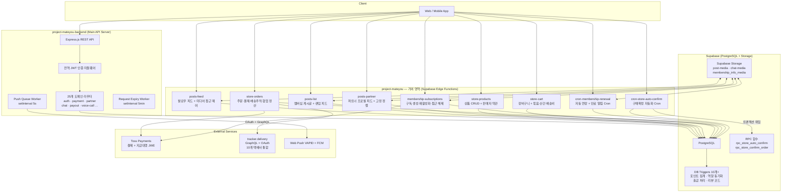

# MateYou Backend — 포트폴리오

> **게이밍 파트너 매칭 플랫폼**의 백엔드 서버 및 자동화 서비스 통합 저장소  
> TypeScript · Node.js · Deno · Supabase Edge Functions · PostgreSQL · Toss Payments

---

## 목차

1. [프로젝트 개요](#1-프로젝트-개요)
2. [전체 서비스 아키텍처](#2-전체-서비스-아키텍처)
3. [기술 스택 및 선정 이유](#3-기술-스택-및-선정-이유)
4. [기여 영역 — 비즈니스 로직 및 운영 자동화](#4-기여-영역--비즈니스-로직-및-운영-자동화)
5. [핵심 기능 상세](#5-핵심-기능-상세)
6. [트러블슈팅 및 설계 결정](#6-트러블슈팅-및-설계-결정)
7. [환경 설정](#7-환경-설정)

---

## 1. 프로젝트 개요

MateYou는 게임을 함께할 파트너를 찾는 사용자(Member)와 서비스를 제공하는 파트너(Partner)를 연결하는 플랫폼입니다. 단순 매칭을 넘어 **멤버십 구독 경제**, **실물·디지털 커머스 스토어**, **피드 기반 콘텐츠 플랫폼**, **전면 자동화 운영**을 아우르는 복합 비즈니스 로직을 처리합니다.

이 저장소는 두 개의 독립적인 서버 프로세스로 구성됩니다.

| 프로젝트 | 역할 | 런타임 |
|---|---|---|
| `project-mateyou-backend` | 인증·결제·매칭 등 메인 REST API 서버 | Node.js / Express |
| `project-mateyou` | 멤버십·스토어 비즈니스 로직, Cron 자동화, 피드·콘텐츠 제어 | Deno / Supabase Edge Functions |

---

## 2. 전체 서비스 아키텍처



### 두 레이어의 역할 분리

메인 서버(`project-mateyou-backend`)는 인증·실시간 매칭·지급대행 등 동기 응답이 필요한 API를 담당합니다. **Supabase Edge Functions**는 멤버십·스토어·피드처럼 비즈니스 규칙이 복잡하고 외부 서비스 연동이 많은 도메인을 독립된 서버리스 함수로 분리합니다. Supabase Scheduler(pg_cron)가 Cron을 자동 트리거하므로 별도 작업 서버가 필요하지 않습니다.

---

## 3. 기술 스택 및 선정 이유

**Deno + Supabase Edge Functions** — 표준 Web API(`fetch`, `Request`, `Response`)를 그대로 쓸 수 있어 tracker.delivery GraphQL, Toss Payments, 내부 push-native 함수 등 HTTP 연동이 많은 도메인에서 런타임 종속성이 낮습니다.

**PostgreSQL RPC 기반 트랜잭션 위임** — 자동 구매확정처럼 포인트 적립·상태 변경이 원자적으로 처리되어야 하는 시나리오에서 Supabase 클라이언트의 멀티 스텝 트랜잭션 한계를 극복하는 핵심 선택이었습니다.

**Signed URL 기반 미디어 접근 제어** — Storage 버킷을 Public으로 열지 않고 서버 사이드에서 권한을 동적으로 평가한 뒤 유효 시간이 제한된 URL만 발급합니다. 클라이언트의 직접 Storage 접근을 차단하면서도 권한이 있는 사용자에게는 즉각적인 콘텐츠 노출이 가능합니다.

**보상 트랜잭션 패턴** — Supabase 클라이언트로 멀티 스텝 작업을 처리할 때, 핵심 단계가 실패하면 이전 단계에서 삽입된 레코드를 명시적으로 삭제하여 중간 상태가 남지 않도록 설계했습니다.

---

## 4. 기여 영역 — 비즈니스 로직 및 운영 자동화

아래는 팀 내에서 직접 전담 개발한 기능 영역입니다. 수익 파이프라인의 생성(구독·구매)부터 자동 운영(Cron), 콘텐츠 노출 제어(피드·접근 권한), 운영 효율화(자동 구매확정)까지 **서비스의 수익성과 안정성을 직접 지탱하는 레이어 전체**를 담당했습니다.

| 영역 | 파일 | 규모 | 핵심 책임 |
|---|---|---|---|
| 피드 콘텐츠 제어 | `posts-feed.ts` | ~420 LOC | 팔로우 피드, 미디어 접근 제어, 양방향 차단 필터링 |
| 피드 고급 필터 | `posts-list.ts` | ~1,000 LOC | 멤버십 구독 게시글, tier_rank 기반 권한, 랜덤 피드 |
| 파트너 프로필 피드 | `posts-partner.ts` | ~281 LOC | 파트너별 피드, 고정 게시글 우선 정렬, Signed URL |
| 스토어 상품 | `store-products.ts` | ~1,690 LOC | 상품 CRUD, 이미지 업로드, 판매자 약관 관리 |
| 장바구니 | `store-cart.ts` | ~1,377 LOC | 장바구니, 묶음배송 계산, 산간 지역 추가 배송비 |
| 주문·정산 | `store-orders.ts` | ~3,617 LOC | 주문 생성, 배송추적, 협업 다자간 포인트 배분 |
| 멤버십 구독 | `membership-subscriptions.ts` | ~923 LOC | 구독 생성·재활성화, 콘텐츠 접근 해제, 보상 롤백 |
| 멤버십 Cron | `cron-membership-renewal.ts` | ~778 LOC | 자동 연장, 만료 알림, 중복 알림 방지 |
| 스토어 Cron | `cron-store-auto-confirm.ts` | ~193 LOC | 구매확정 자동화, PostgreSQL RPC 트랜잭션 위임 |

---

## 5. 핵심 기능 상세

### 5-1. 피드 미디어 접근 제어 엔진

`posts-feed.ts`, `posts-list.ts`, `posts-partner.ts`는 동일한 `processMediaAccess` 함수를 공유하며, 요청 컨텍스트에 따라 **미디어 파일 단위로** 접근 권한을 계산합니다. 이 엔진이 플랫폼의 멤버십 구독 가치를 직접 지탱합니다.

#### 권한 평가 매트릭스

| 사용자 유형 | 무료 게시글 | 유료 게시글 (`point_price > 0`) | 멤버십 전용 (`is_subscribers_only`) |
|---|---|---|---|
| Admin / 콘텐츠 소유 파트너 | ✅ 전체 | ✅ 전체 | ✅ 전체 |
| 비로그인 게스트 | tier_rank = 0만 | ❌ | ❌ |
| 로그인 (구독 없음) | tier_rank = 0만 | 구매한 인덱스까지만 | ❌ |
| 로그인 (멤버십 구독) | userTierRank ≥ mediaTierRank | 구독 **또는** 구매 | userTierRank > 0 필수 |

`posts-partner.ts`의 유료 게시글은 구독 **OR** 구매(어느 한 쪽)로 접근 가능하고, `posts-feed.ts`의 구독자 전용 게시글은 멤버십 구독이 반드시 필요합니다. 두 파일이 동일한 함수를 공유하면서 조건 분기를 통해 컨텍스트에 맞는 규칙을 적용합니다.

```typescript
// posts-partner.ts — 유료: 구독 OR 구매 (어느 한쪽이면 접근)
if (postPrice > 0 || mediaPrice > 0) {
  const isPurchased = postUnlockOrder != null && i <= postUnlockOrder;
  canAccess = hasMembershipAccess || isPurchased;
}

// posts-feed.ts — 구독자 전용: 구독이 반드시 있어야 함
if (isSubscribersOnly) {
  hasMembershipAccess = userTierRank > 0
    && (mediaTierRank === 0 || userTierRank >= mediaTierRank);
}
```

권한이 있으면 Supabase Storage에서 1시간짜리 Signed URL을 발급합니다. **원본 `media_url`은 권한 여부와 관계없이 항상 응답에서 제거**합니다. 원본 경로가 유출되면 Signed URL 체계를 우회할 수 있기 때문입니다.

```typescript
if (canAccess && media.media_url) {
  const { data: signed } = await supabase.storage
    .from("post-media")
    .createSignedUrl(media.media_url, 3600);
  media.signed_url = signed?.signedUrl || null;
}
delete media.media_url; // 권한과 무관하게 원본 경로는 반드시 제거
```

#### 멤버십 tier_rank 조회 — N+1 방지

피드의 게시글마다 멤버십을 개별 조회하면 N+1 문제가 발생합니다. 요청 시작 시 해당 유저의 구독 목록을 **단 1회** 조회하여 `Map<partnerId, maxTierRank>`로 캐싱하고, 이후 미디어 권한 계산은 메모리 Map 조회로만 처리합니다. 동일 파트너에 여러 티어의 멤버십을 구독한 경우 자동으로 최고 티어를 적용합니다.

```typescript
// 구독 목록 단 1회 조회 후 캐싱
(subscriptions || []).forEach((s) => {
  const existing = subscribedMembershipTierRanks.get(m.partner_id) ?? 0;
  // 같은 파트너에 복수 멤버십이 있으면 최고 tier_rank 적용
  subscribedMembershipTierRanks.set(
    m.partner_id,
    Math.max(existing, m.tier_rank ?? 0)
  );
});
```

#### 차단 관계의 양방향 필터링 (`posts-feed.ts`)

"내가 차단한 파트너"뿐 아니라 "나를 차단한 사용자"의 콘텐츠도 피드에서 제거합니다. `member_blocks` 테이블은 `member_code`와 `member_id` 두 가지 식별자가 혼재하므로, 양방향 조회 결과를 Set으로 중복 제거하여 최종 차단 목록을 구성합니다.

#### 고정 게시글 우선 정렬 (`posts-partner.ts`)

파트너 프로필 피드는 `is_pinned` 게시글이 항상 최상단에 표시됩니다. `sortPostsByPinnedAndDate` 함수는 고정 여부를 1차 기준, `published_at`을 2차 기준으로 정렬합니다. `is_pinned`는 boolean · string · number 세 가지 타입이 혼재할 수 있어 모든 truthy 케이스를 명시적으로 처리했습니다.

```typescript
function sortPostsByPinnedAndDate(posts: any[]): any[] {
  return posts.sort((a, b) => {
    const aPinned = a.is_pinned === true || a.is_pinned === 'true' || a.is_pinned === 1;
    const bPinned = b.is_pinned === true || b.is_pinned === 'true' || b.is_pinned === 1;
    if (aPinned === bPinned) {
      return new Date(b.published_at || 0).getTime() - new Date(a.published_at || 0).getTime();
    }
    return aPinned ? -1 : 1; // 고정 게시글이 위로
  });
}
```

---

### 5-2. 멤버십 구독 시스템 — 10단계 파이프라인

멤버십 구독은 단순한 레코드 삽입이 아닙니다. 포인트 결제, 파트너 수익 적립, 콘텐츠 접근 해제, 환영 미디어 발송까지 **10개의 연쇄 작업**이 순서를 보장하며 실행됩니다.

```
POST /api-membership-subscriptions

Step  1.  멤버십 유효성 검증 (is_active, 가격 > 0)
Step  2.  유저 포인트 잔액 확인 (currentPoints ≥ totalPrice)
Step  3.  중복 구독 확인 → inactive면 재활성화 / 없으면 신규 생성
Step  4.  member_points_logs INSERT (type='spend', log_id 포함)
Step  5.  members.total_points 차감
              ↑ 실패 시 → Step 4 로그 + Step 3 구독 레코드 명시적 삭제(보상 트랜잭션)
Step  6.  partners.total_points 적립 + partner_points_logs 기록
Step  7.  album_posts 썸네일에 Signed URL 즉시 발급 → 구독과 동시에 콘텐츠 노출
Step  8.  membership.subscription_count 증가 (통계 및 수정 제한 목적)
Step  9.  파트너에게 새 구독 푸시 알림 전송
Step 10.  구독자에게 환영 메시지 + 멀티미디어 채팅 자동 발송
```

#### 구독 직후 콘텐츠 접근 즉시 해제

멤버십 전용 게시글은 구독 전까지 `album_posts.thumbnail`이 `null`로 저장되어 블러 처리됩니다. Step 7에서 해당 유저의 `album_posts` 레코드를 찾아 Supabase Storage에서 Signed URL을 **동기적으로** 발급합니다. 구독 API 응답이 클라이언트에 도달하는 순간 이미 썸네일이 갱신되어 있으므로, **별도 새로고침 없이 콘텐츠가 열립니다.**

Step 7의 실패는 구독 자체를 롤백하지 않도록 별도 `try-catch`로 격리했습니다. 썸네일 갱신은 부가 기능이므로 실패가 핵심 거래를 오염시키지 않아야 합니다.

#### 보상 트랜잭션 패턴

Supabase 클라이언트는 멀티 스텝 DB 트랜잭션을 지원하지 않습니다. 포인트 차감(Step 5)이 실패하면 이미 삽입된 포인트 로그(Step 4)와 구독 레코드(Step 3)를 명시적으로 삭제합니다. 중간 상태가 DB에 남지 않도록 하는 이 패턴은 스토어 구매, 멤버십 연장 등 포인트가 오가는 모든 핵심 흐름에 일관되게 적용되어 있습니다.

```typescript
if (memberUpdateError) {
  // Step 4 롤백: 포인트 로그 삭제
  await supabase.from('member_points_logs').delete()
    .eq('member_id', user.id).eq('log_id', logId);
  // Step 3 롤백: 구독 레코드 삭제
  await supabase.from('membership_subscriptions').delete()
    .eq('id', subscription.id);
  throw memberUpdateError;
}
```

#### 구독 상태 필터링 — 자동 연장 ON/OFF 분기

`GET /api-membership-subscriptions`는 유효한 구독만 반환해야 합니다. 자동 연장이 켜진 구독은 만료일이 지나도 Cron이 갱신하므로 항상 유효하고, 꺼진 구독은 만료일이 오늘 이후인 경우에만 표시합니다.

```typescript
const validSubscriptions = subscriptions.filter((sub) => {
  if (sub.auto_renewal_enabled) return true;         // 자동 연장 ON → 항상 유효
  return sub.expired_at >= todayStr;                 // 자동 연장 OFF → 만료일 기준
});
```

---

### 5-3. 멤버십 자동 갱신 Cron — `cron-membership-renewal.ts`

매일 자동으로 실행되며 **파트너의 반복 수익을 무중단으로 유지**합니다. 수동 개입 없이 결제와 콘텐츠 제공이 자동으로 연속되는 것이 이 모듈의 핵심 가치입니다.

```
Phase 1 — 자동 연장 처리
  대상: status='active', auto_renewal_enabled=true, expired_at=오늘

  포인트 충분 → 차감 + 만료일 +1개월 + 파트너 수익 적립
               → 연장 성공 푸시 알림
               → renewal_message / renewal_media_info → 갱신 환영 채팅 자동 발송

  포인트 부족 → status='canceled' + 연장 실패 푸시 알림

Phase 2 — 만료 예정 알림
  대상: status='active', auto_renewal_enabled=false, expired_at=내일
  → "내일 만료됩니다" 푸시 알림 (재구독 유도)
```

#### 자동 갱신 시 채팅 미디어 전송

파트너가 멤버십에 `renewal_message` 또는 `renewal_media_info`를 설정해두면, 갱신 완료 시 파트너가 사전 등록한 메시지와 미디어를 구독자 채팅방에 자동으로 발송합니다. `membership_info_media` 버킷에서 파일을 다운로드하여 `chat-media` 버킷에 재업로드하는 방식이므로, 파트너는 수동 개입 없이 **자동화된 구독자 케어**가 가능합니다. 이는 구독 유지율(retention)을 높이는 데 직접 기여합니다.

#### 알림 중복 방지 — dismissed_at 내재화

크론잡이 매일 실행되는 특성상 같은 알림이 반복 발송될 수 있습니다. 별도 알림 이력 테이블을 만드는 대신, `membership_subscriptions` 레코드에 `expiry_notification_dismissed_at`, `renewal_failed_notification_dismissed_at`, `renewed_notification_dismissed_at` 세 컬럼을 추가했습니다.

사용자가 알림을 확인하면 `PATCH` 요청으로 해당 값이 기록됩니다. Cron 쿼리는 이 컬럼이 `null`인 레코드만 조회하므로, 한 번 확인된 알림은 다시 발송되지 않습니다.

```typescript
// 아직 확인하지 않은 만료 예정 구독만 조회
.is('expiry_notification_dismissed_at', null)  // 확인 전 레코드만
.gte('expired_at', today)
.lte('expired_at', threeDaysLater)             // 3일 이내 만료 예정
```

기존 테이블에 상태를 내재화하여 별도 테이블 없이 **정확히 1회 발송을 보장**하고 쿼리 복잡도를 최소화했습니다.

---

### 5-4. 스토어 자동 구매확정 Cron — `cron-store-auto-confirm.ts`

배송 완료 후 3일이 경과한 주문을 자동으로 구매확정하고 파트너에게 포인트를 적립합니다. 이 모듈의 핵심 설계 결정은 **비즈니스 로직을 Edge Function이 아닌 PostgreSQL RPC 함수에 완전히 위임**한 것입니다.

```typescript
// Edge Function은 RPC를 트리거하는 얇은 진입점
const { data: rpcResult, error: rpcError } = await supabase.rpc(
  'rpc_store_auto_confirm',
  { p_days_threshold: daysThreshold }
);
```

**RPC를 선택한 이유:** 구매확정은 `store_orders.is_confirmed` 변경, `store_order_items.status` 변경, `partners.store_points` 적립, `partner_points_logs` 기록이 하나의 원자 단위로 처리되어야 합니다. Supabase 클라이언트로 순차 실행하면 중간 실패 시 불완전한 상태가 남고, Cron이 재실행될 때 포인트 이중 적립이 발생합니다. PostgreSQL 트랜잭션으로 위임하면 이 모든 문제가 DB 레벨에서 자동으로 해결됩니다.

관리자용 수동 확정(`PUT`)도 동일한 `rpc_store_confirm_order`를 사용하여 **자동/수동 경로의 로직을 일원화**했습니다. 로직이 한 곳(RPC 함수)에만 존재하므로 수정이나 버그 수정이 양쪽에 자동으로 적용됩니다.

---

### 5-5. 스토어 장바구니 — 묶음배송과 산간 지역 배송비 계산

`store-cart.ts`는 단순한 목록 관리를 넘어 **복잡한 배송비 계산 엔진**을 내장합니다.

#### 묶음배송 그룹핑 로직

`is_bundle_available=true` 상품들은 같은 출처(파트너 직접 상품 / 협업 상품)끼리 묶어 가장 비싼 배송비 하나만 부과합니다. 4가지 경우를 별도로 처리합니다.

```
파트너 묶음 상품   → max(shipping_fee_base)          — 1회만 부과
파트너 비묶음 상품  → Σ shipping_fee_base             — 상품별 합산
협업 묶음 상품    → max(shipping_fee_base)          — 1회만 부과
협업 비묶음 상품   → Σ shipping_fee_base             — 상품별 합산
```

#### 산간 지역 추가 배송비

배송지 우편번호를 파싱하여 제주도(63000–63644)와 울릉도(40200–40240)를 판별하고, 해당 지역이면 `shipping_fee_remote`를 기본 배송비에 추가합니다. 묶음배송 적용 시에도 `baseFee + remoteFee` 합산 기준으로 max를 취하여 산간 추가 배송비가 정확히 반영됩니다.

```typescript
function isRemoteArea(postalCode: string): boolean {
  const code = parseInt(postalCode.replace(/\D/g, ''), 10);
  if (code >= 63000 && code <= 63644) return true; // 제주도
  if (code >= 40200 && code <= 40240) return true; // 울릉도
  return false;
}

// 묶음 최대 배송비도 baseFee + remoteFee 합산 기준으로 비교
const getItemShippingFee = (item: CartItem) =>
  (item.product.shipping_fee_base || 0) +
  (isRemote ? item.product.shipping_fee_remote || 0 : 0);
```

---

### 5-6. 스토어 주문 정산 — 협업 다자간 수익 배분

협업 상품은 동일 원본 상품에 여러 파트너가 참여하여 판매 수익을 나눕니다. `share_rate`(전체 수익 배분율)와 `distribution_rate`(개인 지급율)의 2단계 구조를 구현했습니다.

```typescript
// share_rate 설정 시 — 다자 배분 모드
// 예: totalAmount=10만원, shareRate=60%, distRate=80% → 48,000원 적립
const partnerAmount = Math.floor(
  totalAmount * (shareRate / 100) * (distRate / 100)
);

// share_rate 전원 null — 개별 정산 모드 (주문 파트너에게만)
const settledAmount = Math.floor(totalAmount * (distRate / 100));
```

**멱등성 보장:** `log_id = store_sale_{orderId}_{partnerId}_{productId}` 결정론적 고유 키를 사용합니다. 적립 전 `partner_points_logs`에서 동일 `log_id`를 확인하고, 이미 존재하면 건너뜁니다. Webhook 재전송이나 Cron 중복 실행 상황에서도 정산이 정확히 1회만 처리됩니다.

---

## 6. 트러블슈팅 및 설계 결정

### [이슈 1] 구독 완료 후 콘텐츠 노출 지연

**문제:** 멤버십 구독 API 응답 후 프론트엔드가 피드를 재호출해야 구독 전용 콘텐츠가 노출되었습니다. 이 사이에 일시적인 "접근 불가" 상태가 표시되어 UX를 저해했습니다.

**해결:** 구독 완료 핸들러(Step 7) 내에서 `album_posts` 썸네일 갱신을 동기적으로 처리했습니다. 응답이 클라이언트에 도달하는 시점에 이미 Signed URL이 DB에 기록되어 있어 즉각 노출이 가능합니다. 갱신 실패는 `try-catch`로 격리하여 핵심 구독 흐름을 보호했습니다.

### [이슈 2] 자동 갱신 Cron의 알림 중복 발송

**문제:** 매일 실행되는 Cron이 만료 예정 알림을 D-3, D-2, D-1에 매일 동일하게 재발송했습니다.

**해결:** `membership_subscriptions`에 `*_notification_dismissed_at` 컬럼을 추가하고 크론 쿼리에 `.is(..., null)` 조건을 적용했습니다. 사용자가 알림을 확인하면 `PATCH`로 기록되고, 다음 Cron 실행부터 해당 레코드는 조회 대상에서 제외됩니다. 별도 이력 테이블 없이 기존 구독 레코드에 상태를 내재화했습니다.

### [이슈 3] 자동 구매확정 Cron의 포인트 이중 적립

**문제:** Cron 재실행 또는 중복 트리거 시 파트너 포인트가 이중으로 적립될 수 있었습니다.

**해결:** 구매확정 로직 전체를 PostgreSQL RPC 함수로 이전했습니다. DB 트랜잭션 내에서 `is_confirmed=false` 확인, 포인트 적립, 상태 변경이 원자적으로 처리되어 중간 실패 시 전체가 롤백됩니다. Edge Function은 RPC를 호출하는 얇은 진입점으로만 남겨, 비즈니스 로직과 실행 진입점을 분리했습니다.

### [이슈 4] 협업 정산의 멱등성 결여

**문제:** 결제 완료 Webhook 중복 수신 시 여러 파트너에게 정산 포인트가 이중으로 적립되었습니다.

**해결:** `log_id = store_sale_{orderId}_{partnerId}_{productId}` 결정론적 고유 키를 도입하고, 적립 전 `partner_points_logs`에서 동일 `log_id`의 존재 여부를 확인합니다. 어떤 경로로 중복 실행되더라도 정산이 정확히 1회만 처리됩니다.

### [이슈 5] 배송추적 외부 API 레이턴시 및 과호출

**문제:** 주문 상세 조회마다 tracker.delivery API를 호출하면 응답 레이턴시가 증가하고 API 요금이 과다 부과됩니다.

**해결:** 2단계 캐싱을 적용했습니다. OAuth 토큰은 `만료 시각 - 60초` 기준으로 인메모리 캐시합니다. 배송 이벤트는 `store_shipments.delivery_updated_at`이 5분 이내면 DB 캐시를 반환하고, 5분 초과 시에만 외부 API를 호출 후 결과를 DB에 갱신합니다. `registerTrackWebhook` Mutation으로 배달 완료 이벤트를 Webhook으로 수신하여 폴링 의존도도 낮췄습니다.

### [이슈 6] `is_pinned` 타입 불일치로 인한 정렬 오류

**문제:** `posts-partner.ts`에서 고정 게시글이 최상단에 표시되지 않는 경우가 있었습니다. DB 컬럼이 상황에 따라 `true`, `'true'`, `1` 세 가지 형태로 반환되었기 때문입니다.

**해결:** `sortPostsByPinnedAndDate` 함수에서 세 가지 타입을 모두 명시적으로 처리했습니다. TypeScript 타입 시스템만 믿지 않고 런타임 값을 방어적으로 검사하는 패턴을 피드, 피드 리스트, 파트너 피드 전체에 일관되게 적용했습니다.

```typescript
const isPinned = post.is_pinned === true || post.is_pinned === 'true' || post.is_pinned === 1;
```

---

## 7. 환경 설정

```bash
# ── Server ──────────────────────────────────────────
PORT=4000
NODE_ENV=production

# ── Supabase ────────────────────────────────────────
SUPABASE_URL=https://xxxx.supabase.co
SUPABASE_ANON_KEY=eyJ...
SUPABASE_SERVICE_ROLE_KEY=eyJ...

# ── Toss Payments (일반 결제) ───────────────────────
TOSS_PAY_PROD_SECRET_KEY=live_sk_...

# ── Toss Payments (지급대행) ────────────────────────
TOSS_API_PROD_SECRET_KEY=live_gsk_...
TOSS_API_PROD_SECURITY_KEY=<64자 hex>
TOSS_USE_PYTHON_ENCRYPTION=false   # Node.js jose(기본) vs Python authlib

# ── 배송추적 (tracker.delivery OAuth) ───────────────
TRACKER_DELIVERY_CLIENT_ID=...
TRACKER_DELIVERY_CLIENT_SECRET=...

# ── Web Push (VAPID) ────────────────────────────────
VAPID_PUBLIC_KEY=...
VAPID_PRIVATE_KEY=...
VAPID_SUBJECT=mailto:noreply@mateyou.com

# ── Worker 튜닝 ──────────────────────────────────────
PUSH_QUEUE_INTERVAL=5000           # Push Queue 폴링 간격 (ms)
PUSH_QUEUE_BATCH_SIZE=50           # 1회 처리 최대 건수
ENABLE_PUSH_QUEUE_WORKER=true
REQUEST_EXPIRY_INTERVAL=300000     # 의뢰 만료 체크 간격 (ms)
ENABLE_REQUEST_EXPIRY_WORKER=true
```

> **보안 주의:** `live_` 접두사가 없는 test 키는 서버 시작 시 자동 거부되며 `console.error`로 명시적 경고가 출력됩니다.

---

## Tech Stack Summary

| 분류 | 기술 |
|---|---|
| Runtime — API Server | Node.js (ESM) + Express.js |
| Runtime — Edge Functions | Deno + Supabase Edge Functions |
| Language | TypeScript |
| Database | PostgreSQL (via Supabase), RPC 트랜잭션, Trigger 10개+ |
| Auth | Supabase Auth + JWT 미들웨어 |
| Payment | Toss Payments (결제 + 지급대행, JWE / AES-256-GCM) |
| Push | Web Push Protocol (VAPID) + FCM |
| Delivery | tracker.delivery GraphQL API (OAuth 인메모리 캐싱) |
| Storage | Supabase Storage (Signed URL 기반 접근 제어) |
| Scheduling | Supabase Scheduler (pg_cron) |
| Real-time | Supabase Realtime + WebRTC (voice / video) |
| API Docs | Swagger (swagger-jsdoc) |
