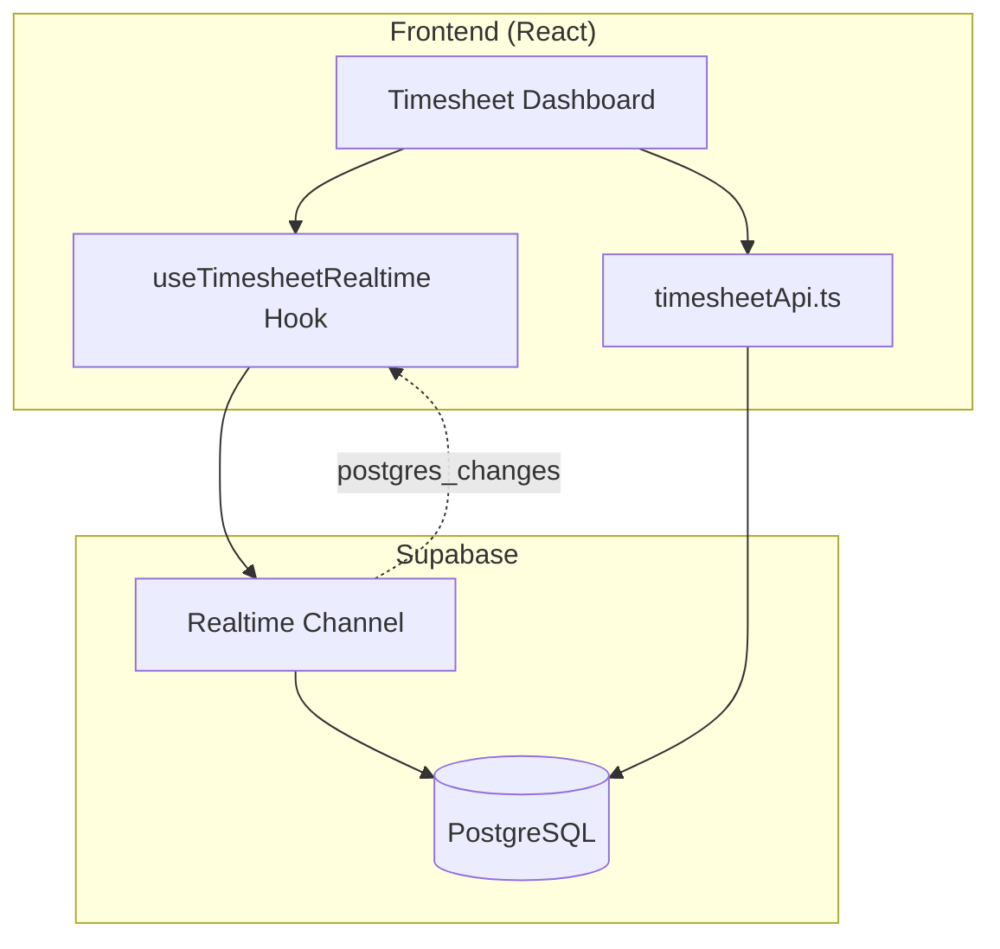
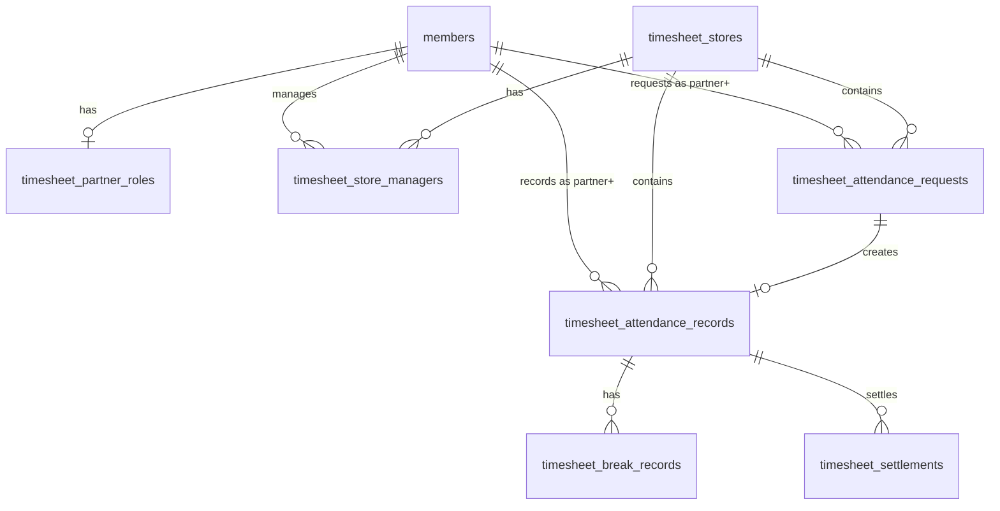
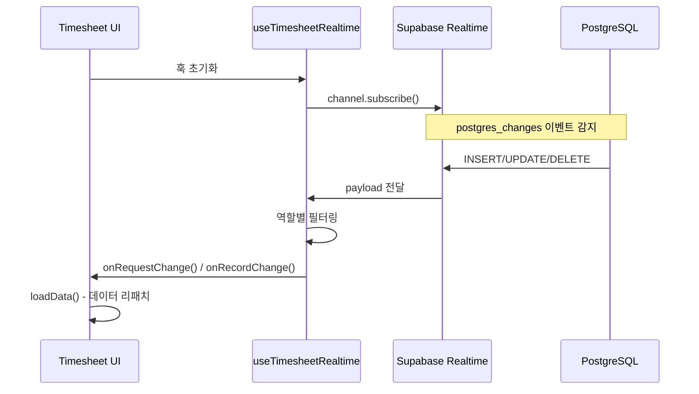
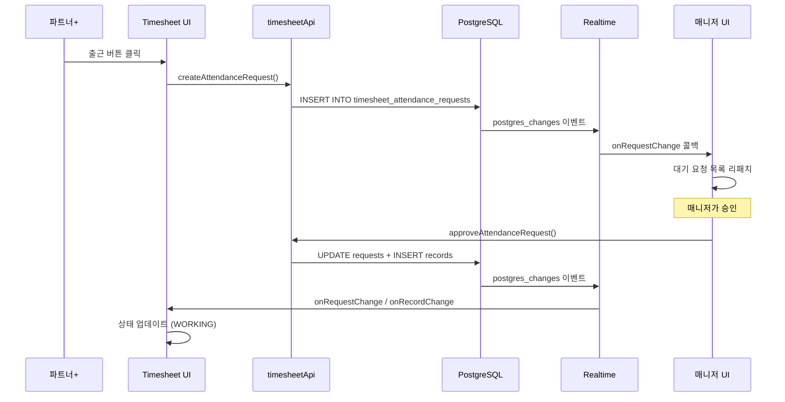
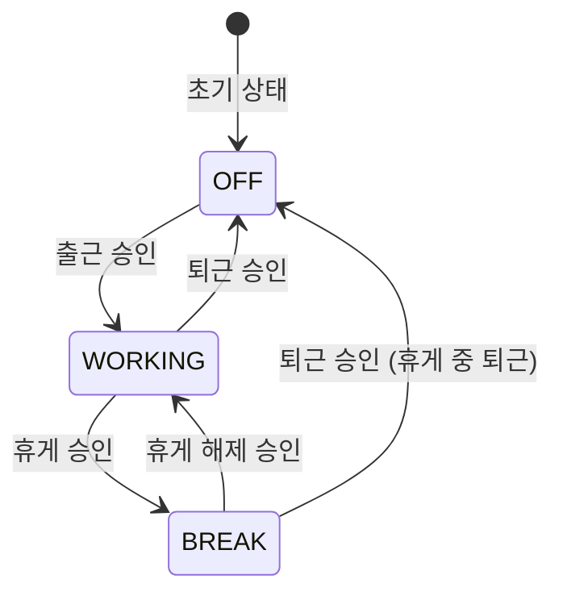

# Timesheet(출근부) 시스템 아키텍처 분석

## 개요

Timesheet 시스템은 파트너+의 출근/퇴근/휴게 등 근태 관리를 위한 독립적인 모듈입니다. Supabase의 Realtime 기능을 활용하여 실시간으로 상태 변경을 감지하고 UI를 업데이트합니다.

---

## 시스템 구조도



---

## 데이터베이스 구조

### 핵심 테이블

| 테이블 | 설명 | 주요 컬럼 |
|--------|------|----------|
| `timesheet_stores` | 가게(매장) 정보 | `id`, `name`, `address`, `schedule` |
| `timesheet_partner_roles` | 파트너 역할 정보 | `member_id`, `role_type` |
| `timesheet_store_managers` | 가게-매니저 관계 | `store_id`, `manager_id` |
| `timesheet_attendance_requests` | 근태 요청 | `partner_plus_id`, `store_id`, `request_type`, `status` |
| `timesheet_attendance_records` | 근태 기록 | `partner_plus_id`, `status`, `started_at`, `ended_at` |
| `timesheet_break_records` | 휴게 기록 | `attendance_record_id`, `started_at`, `ended_at` |
| `timesheet_audit_logs` | 감사 로그 | `actor_id`, `action`, `target_type` |
| `timesheet_settlements` | 정산 데이터 | `partner_plus_id`, `work_hours`, `total_amount` |

### 테이블 관계도



### ENUM 타입

```typescript
// 근태 상태
type TimesheetAttendanceStatus = 'OFF' | 'WORKING' | 'BREAK'

// 요청 상태
type TimesheetRequestStatus = 'pending' | 'approved' | 'rejected' | 'cancelled'

// 역할 타입
type TimesheetRoleType = 'partner_plus' | 'partner_manager' | 'partner_m'

// 요청 타입
type TimesheetRequestType = 'WORKING' | 'BREAK' | 'BREAK_END' | 'OFF'
```

---

## Realtime 구독 구조

### useTimesheetRealtime Hook

파일: [useTimesheetRealtime.ts](file:///Users/jidong/workspace/side/moemoe/mate_you/src/hooks/useTimesheetRealtime.ts)

역할별로 다른 필터를 적용하여 Realtime 구독을 설정합니다.



### 역할별 구독 전략

| 역할 | 구독 대상 | 필터 조건 |
|------|----------|----------|
| **파트너+** | 본인의 요청/기록 | `partner_plus_id=eq.{userId}` |
| **매니저** | 담당 가게의 요청/기록 | 클라이언트 필터링 (담당 store_id 확인) |
| **어드민** | 모든 요청/기록 | 필터 없음 |

### 구독 채널 구조

```typescript
// 채널명 패턴
const channelName = `timesheet-realtime-${user.id}`

// 구독 이벤트
channel.on('postgres_changes', {
  event: '*',  // INSERT, UPDATE, DELETE 모두 감지
  schema: 'public',
  table: 'timesheet_attendance_requests',
  filter: `partner_plus_id=eq.${user.id}`,  // 파트너+ 전용
}, handleRequestChange)
```

---

## 데이터 흐름

### 출근 요청 플로우



### 상태 전이 규칙



---

## API 구조

### 주요 API 함수

파일: [timesheetApi.ts](file:///Users/jidong/workspace/side/moemoe/mate_you/src/lib/timesheetApi.ts)

#### 상태 조회

| 함수 | 설명 |
|------|------|
| `getTimesheetRole(memberId)` | 사용자의 역할 조회 |
| `getCurrentAttendanceStatus(partnerPlusId)` | 현재 근태 상태 조회 |
| `getCurrentAttendanceRecord(partnerPlusId)` | 현재 출근 기록 조회 |
| `hasPendingRequest(partnerPlusId)` | 대기 중 요청 확인 |

#### 요청 관리

| 함수 | 설명 |
|------|------|
| `createAttendanceRequest(...)` | 근태 요청 생성 |
| `approveAttendanceRequest(requestId, managerId, options)` | 요청 승인 |
| `rejectAttendanceRequest(requestId, managerId, reason)` | 요청 반려 |
| `cancelAttendanceRequest(requestId, partnerPlusId)` | 요청 취소 |

#### 목록 조회

| 함수 | 설명 |
|------|------|
| `getPendingRequests(managerId?)` | 대기 중 요청 목록 |
| `getWorkingPartners(managerId?)` | 현재 출근 중인 파트너+ 목록 |
| `getAttendanceHistory(partnerPlusId, limit)` | 근태 이력 조회 |
| `getBreakRecords(attendanceRecordId)` | 휴게 기록 조회 |

---

## 라우트 구조

### 페이지 구조

```
/timesheet
├── index.tsx        # 메인 대시보드 (파트너+/매니저 통합)
└── admin/
    └── index.tsx    # 어드민 관리 페이지
```

### 메인 대시보드 ([index.tsx](file:///Users/jidong/workspace/side/moemoe/mate_you/src/routes/timesheet/index.tsx))

역할에 따라 다른 뷰를 렌더링:

- **파트너+**: `PartnerPlusView` - 출근/휴게/퇴근 요청 UI
- **매니저/어드민**: `ManagerView` - 요청 승인/반려, 출근자 관리

---

## 컴포넌트 구조

```
src/components/features/timesheet/
├── AttendanceRequestSheet.tsx    # 요청 바텀시트 (파트너+용)
├── WorkingPartnerDetailSheet.tsx # 출근자 상세 바텀시트 (매니저용)
├── DateRangeCalendar.tsx         # 기간 선택 캘린더
├── DateTimePicker.tsx            # 날짜/시간 선택
├── StatusDisplay.tsx             # 상태 표시 컴포넌트
└── index.ts                      # 배럴 파일
```

---

## Realtime 최적화

### 현재 적용된 최적화

1. **Ref 기반 콜백 관리**: 콜백 함수를 `useRef`로 관리하여 불필요한 재구독 방지
2. **정리(Cleanup) 로직**: 컴포넌트 언마운트 시 채널 구독 해제
3. **로딩 스피너 분리**: 초기 로딩과 Realtime 업데이트를 구분하여 UX 개선

### useOptimizedRealtime Hook

파일: [useOptimizedRealtime.ts](file:///Users/jidong/workspace/side/moemoe/mate_you/src/hooks/useOptimizedRealtime.ts)

범용적인 Realtime 구독을 위한 최적화된 훅:

- 연결 상태 관리 (`connecting`, `connected`, `disconnected`, `error`)
- 자동 재연결 로직
- 에러 핸들링

---

## 권한 및 보안

### 역할 기반 접근 제어

```typescript
// useTimesheetRole.ts에서 역할 확인
const { role, isAdmin, isPartnerManager, isPartnerPlus, hasAccess } = useTimesheetRole()
```

| 역할 | 접근 가능 기능 |
|------|---------------|
| `partner_plus` | 본인 요청 생성/취소, 본인 상태 조회 |
| `partner_manager` | 담당 가게 요청 승인/반려, 출근자 관리 |
| `admin` | 모든 기능 + 시스템 관리 |

### RLS (Row Level Security)

Supabase RLS 정책을 통해 DB 레벨에서 접근 제어 적용됨.

---

## 관련 파일 목록

### 훅 (Hooks)

- [useTimesheetRealtime.ts](file:///Users/jidong/workspace/side/moemoe/mate_you/src/hooks/useTimesheetRealtime.ts) - Timesheet 전용 Realtime 훅
- [useTimesheetRole.ts](file:///Users/jidong/workspace/side/moemoe/mate_you/src/hooks/useTimesheetRole.ts) - 역할 확인 훅
- [useOptimizedRealtime.ts](file:///Users/jidong/workspace/side/moemoe/mate_you/src/hooks/useOptimizedRealtime.ts) - 범용 Realtime 훅

### API

- [timesheetApi.ts](file:///Users/jidong/workspace/side/moemoe/mate_you/src/lib/timesheetApi.ts) - API 함수 모음 (65개 함수)

### 라우트

- [/timesheet/index.tsx](file:///Users/jidong/workspace/side/moemoe/mate_you/src/routes/timesheet/index.tsx) - 메인 대시보드
- [/timesheet/admin/](file:///Users/jidong/workspace/side/moemoe/mate_you/src/routes/timesheet/admin) - 어드민 페이지

### Context

- [GlobalRealtimeProvider.tsx](file:///Users/jidong/workspace/side/moemoe/mate_you/src/contexts/GlobalRealtimeProvider.tsx) - 전역 Realtime 컨텍스트 (채팅/파트너 요청용)

### 참고 문서

- [timesheet_db_summary.md](file:///Users/jidong/workspace/side/moemoe/mate_you/timesheet_db_summary.md) - DB 스키마 상세 문서
